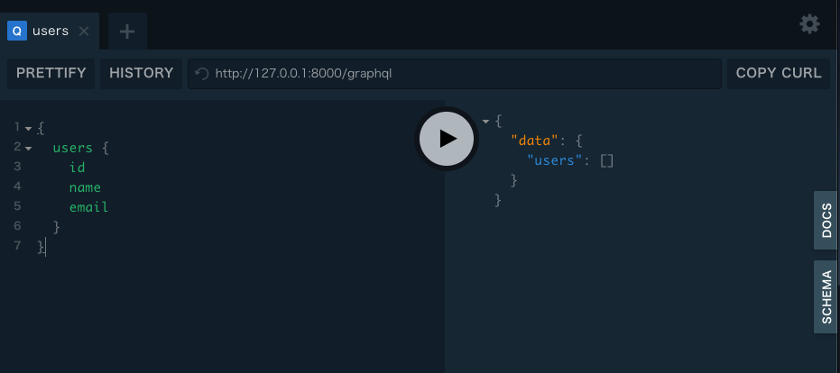
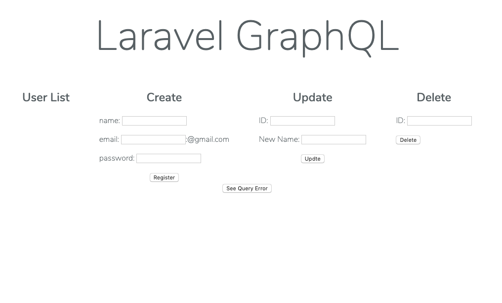

# Set Up

```sh
$ composer install
$ npm install
$ npm run dev
$ cp .env.example .env
$ php artisan key:generate
```

Change `DB_PORT` and `DB_USERNAME` in `.env`

```.env
- DB_PORT=3306
+ DB_PORT=3336

- DB_USERNAME=homestead
+ DB_USERNAME=root
```

Create a MySQL container

```sh
$ docker run --name larave-mysql -u root -e MYSQL_ROOT_PASSWORD=secret -p 3336:3306 -e MYSQL_DATABASE=homestead -d mysql:5.7
```

Migration

```sh
$ php artisan migrate
$ php artisan db:seed
```

```sh
$ php artisan serve
```

Laravel-GraphQL-Playground



http://127.0.0.1:8000/graphql-playground


Top Page



http://127.0.0.1:8000/

Output GraphQL Schema

```bash
$ graphql get-schema laravel-graphql --output=schema.graphql
```
